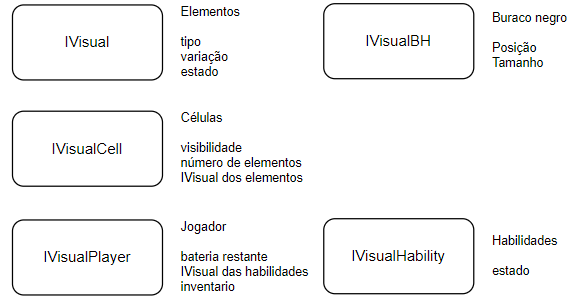
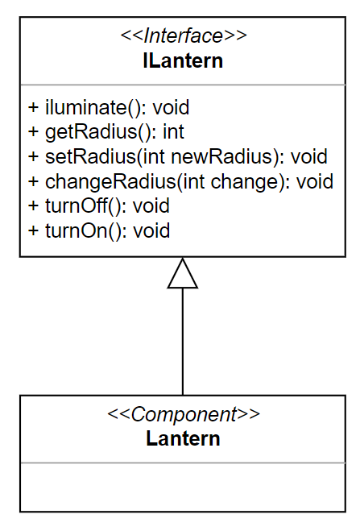

# Projeto `The Gargamaze`

* Projeto Final de POO

# Descrição Resumida do Projeto/Jogo

> O propósito do jogo é a captura dos dois cristais principais para que os jogadores consigam ganhar. Contudo, para isso, os jogadores precisam de habilidades que são adquiridas através da captura de outros cristais que ficam localizados no cantos do mapa, mas para isso precisam vencer desafios em um labirinto com pouca visibilidade e correr contra o seu pior inimigo: O tempo de duração de suas baterias. Além disso, no centro do mapa se encontra um buraco negro que distorce a passagem do tempo aos seus arredores, por conta disso, quanto mais longe do buraco negro os jogadores se encontram mais rapido suas baterias são descarregadas, e quando os jogadores entram no buraco negro, suas baterias são recarregadas. 

# Equipe
* `Thiago Máximo Pavão `           - `247381`
* `Kevin Caio Marques dos Santos ` - `247218`

# Arquivo Executável do Jogo
>[Download](https://drive.google.com/file/d/138DYyCo_OWfGWI8gYvdxZ3F5L54VvRnI/view?usp=sharing)

# Slides do Projeto

## Slides da Prévia
> [Prévia](https://docs.google.com/presentation/d/1mAtWsCDGBxF7lj8pcSTOYw43ReE8C6TG7_TtIIiZnzM/edit?usp=sharing)

## Slides da Apresentação Final

> [Apresentação Final](https://docs.google.com/presentation/d/1Nq9iXtoOGGFCMYAOnZVzsHJ7h0_kNV516n9Oh6eqHng/edit?usp=sharing)

# Relatório de evolução

Inicialmente o projeto começou com uma estrutura base, queríamos poder ter um jogo funcional para poder expandi-lo e modifica-lo com a passagem do tempo, de forma a evitar que o jogo tivesse muitas dificuldades para rodar pela primeira vez. Desenvolvemos então um model simples, apenas com o espaço, com sua matriz de células, o controle recebendo apenas comandos de movimentação e o view apenas colocando cores nas células de acordo com o elemento dentro dela. Tínhamos então apenas dois quadrados que podiam se movimentar em uma matriz, e nesse ponto já existia uma interface gráfica.


A partir disso acrescentamos a leitura de um arquivo .txt para a criação do labirinto em si. Nesse ponto surgiram algumas dúvidas e decisões importantes precisaram ser tomadas, como a de como representaríamos os elementos no arquivo, e além disso, tínhamos a intenção de que algumas partes do labirinto, como o centro e as paredes laterais, fossem sempre iluminadas. Optamos então por ter dois mapas em um mesmo arquivo .txt, um com os elementos e outro que mostrava somente quais teclas sempre seriam iluminadas. Nesse momento decidimos também como representar os botões e os seus respectivos portões que abrem, e foi decidido que, inicialmente esses elementos eram colocados diretamente na matriz do arquivo, porém essa implementação forçava o uso de casting para recuperaos elementos já inseridos no espaço.

Para resolver este problema, os botões e seus portões são passados após as matrizes de elementos e iluminação, de forma que são instanciados, conectados e inseridos no espaço juntos. 

Com a implementação de muitos elementos no jogo que tinham que se comunicar com outros, vimos a necessidade de acrescentar mais interfaces específicas de modo que seria possível essa comunicação sempre garantindo que ela seria controlada e organizada.

Uma dificuldade enfrentada foi na implementação da interface gráfica, uma vez que era desejado que a textura de uma célula mostrasse tudo que existe nela. Isso tornava muito complexo o trabalho do View, que precisava encontrar cada textura para representar cada elemento em cada célula do espaço. Uma solução encontrada foi a criação de uma matriz de células do view, cujas células comunicam-se com as células nas quais os elementos se encontram (matriz do espaço) e com isso descobrem quais texturas devem ser exibidas no momento. E para minimizar a quantidade de texturas carregadas, elas foram carregadas somente uma vez como atributos estáticos da classe ViewCell, de modo que todas as células do view tinham acesso a ela.

Após isso foi implementada a lógica de lanternas, inicialmente as lanterrnas eram associadas internamente aos jogadores, e eles eram responsáveis por iluminar o espaço ao seu redor. Posteriormente, com a chegada da ideia de que seria necessário lanternas para outros elementos, como os cristais, ou botões que ilumissem certos locais, surgiu a ideia de lanternas para controlar a visibilidade do mapa. Ainda mais para o final, surgiu a ideia de existir uma diferença de luminosidade para células mais distantes do centro da lanterna, o que pôde ser feito sem muitas modificações na logica geral, graças à forma que foi feita a lógica de iluminação.

Também inserimos o tempo de vida dos jogadores, novamente, os jogadores eram responsáveis por calcular sua distância ao centro do mapa e atualizar sua vida de acordo, com o desenvolvimento do projeto, essa função foi dada ao próprio buraco negro, quando este foi criado. Isto possibilita que o buraco negro esteja em qualquer local do mapa e ainda tenha o funcionamento esperado, além de retirar do jogador um trabalho que não cabia à ele.

O resto do jogo cresceu naturalmente, as habilidades foram sendo implementadas, o view se complexificou de forma a acompanhar as necessidades do jogo, como mostrar as habilidades dos jogadores e seus inventários assim como o Controle, que se adaptou as novas funções que poderiam ser executadas pelo jogador. Por fim, foram criadas as diferentes telas do jogo, o menu, a tela de finalização da partida, a tela de história e o tutorial. Retocando seus últimos detalhes para garantir um jogo completamente amarrado.

# Destaques de Código

Um dos destaques do nosso código seria a implementação da lanterna, usada para iluminar o mapa. Ela foi implementada para promover a iluminação em lugares específicos que queríamos que fossem iluminados, como as bordas, o centro, os cristais e os jogadores, enquanto que o resto do mapa fica escuro.

```Java
private void buildMaze() throws AssembleError {
    ...
    // Criação das lanternas dos cristais
    Lantern lantern = new Lantern();
    lantern.connect(crystal);
    lantern.connect(space);
    crystal.connect(lantern);
    space.addLantern(lantern);
    ...
}
```

* Codigo criação do cristal do player

```Java
private void createLantern(Player p) {
    Lantern lantern = new Lantern();
    lantern.connect(p);
    lantern.connect(space);
    p.connect(lantern);
    space.addLantern(lantern);
}
```

* Codigo Array de Ilantern do space

```Java
public class Space implements ISpace {
    private Array<ILantern> lanterns = new Array<ILantern>();
    ...
}
```

* Codigo Iluminacao da lanterna

```Java
public class Lantern implements ILantern {
    private ISpaceIluminate space;
    private IPosition element;
    ...
    public void iluminate() {
        ...
        for(int dx = -radius;dx <= radius;dx++) {
            for(int dy = -radius;dy <= radius;dy++) {
                ...
                space.iluminate(getX() + dx, getY() + dy, clarity);
            }
        }
    }
    ...
}
```

O método iluminate da lanterna é chamado pelo espaço quando algum dos jogadores se move ou o estado das lanternas muda. Nesses casos, o espaço escurece o mapa inteiro e pede para cada lanterna iluminar a parte que deve ser iluminada. 

Outro destaque é a forma como as imagens são dispostas na tela, com o uso da sobreposição de imagens para evitar a criação de imagens para casos muito específicos. Por exemplo, em um caso em que um dos jogadores entra na frente dos botões, em uma mesma renderização é desenhado primeiro o botão e depois o jogador. E isso é feito com o uso de um array de texturas de uma mesma célula, um array com todas as texturas em ordem de prioridade é enviada para o view, responsável por desenhá-las na tela.

* Codigo da ViewCell

```Java
public void update() {

    int nbElements = cell.nElements();

    textures.clear();
    textures.add(imgGround);

    if(!cell.visible()) {
        textures.add(imgDark);
        ...
    }
    else {
        for(int i=0;i < nbElements;i++){
            if(cell.visual(i).type() == 'B') {
            if(cell.visual(i).variation() == 'C') {
            if(cell.visual(i).state() == 'p') {
            textures.add(imgButtonPressedFrame);
            textures.add(imgBlueBG);
            textures.add(imgButtonPressed);
            ...
            }
            else if(cell.visual(i).type() == 'P') {
            ...
            }
        }
    }
...
}
```

* Codigo do View

``` Java
private void drawMap() {
    batch.begin();

    for(int x=0;x < size;x++){
        for(int y=0;y < size;y++){
            batch.setColor(1f,1f,1f,1f);
            ViewCell aux = cells[x][y];

            for(Texture texture: aux.getTexture()) {
                batch.draw(texture, aux.getX(), aux,getY(), ViewCell.size, ViewCell.size);
            }
            ...
        }
    }
    batch.end();
}
```

Outro destaque é o controle do tempo de vida dos jogadores dependendo da posição em que eles se encontram no mapa, quanto mais longe do buraco negro mais rápido o tempo passa. Essa implementação se alinha com a ideia do jogo, o buraco negro que se encontra no centro é o responsável por controlar essa variação do tempo.

* Codigo do tempo buraco negro

```Java
public class Blackhole implements IUpdate, ITime, IVisualBH {
    ...
    private IPlayerBH pCase, pTars;
    ...	
    public void update() {
        posCase = pCase.getIPosition();
        posTars = pTars.getIPosition();
        boolean caseIn = inside(posCase);
        boolean tarsIn = inside(posTars);

        if(caseIn)
            incCase = 20000;
        else
            incCase = - (float) distanceFactor(posCase);

        if(tarsIn)
            incTars = 20000;
        else
            incTars = - (float) distanceFactor(posTars);
        ...
    }
    ...
    public void update(float t) {
        pCase.updateTimeRemaining(t * incCase);
        pTars.updateTimeRemaining(t * incTars);
    }
}

```

O incremento é atualizado sempre que um dos jogadores se move, caso o jogador esteja dentro do buraco negro, seu incremento é positivo, caso contrário ele é negativo e tem maior módulo para maiores distâncias da jogador até a posição do buraco negro. Por fim, este incremento é utilizado quando é necessário avisar os jogadores da passagem de tempo.

Outro destaque é que o mapa é criado com base em um arquivo .txt. Por isso, o arquivo foi feito de forma que o mapa pode ser criado em vários tamanhos e com diversas variações de puzzles e desafios, bastando somente alterar o .txt.

* Código do Builder

```Java
public class Builder {
    private void readFile() throws IOException {
        FileHandle handle = Gdx.files.internal(mazePath);
        ...
        readMazeMatrix(lines);
        ...
        readVisibilityMatrix(lines);
        ...
        readButtons(lines);
    }
}
```

Por fim, um último destaque interessante é o da movimentação do jogador pelo mapa: o que indica se um movimento para uma célula é permitido ou não é o conceito de nível de obstrução da célula, isso será explicado mais para frente. O destaque aqui é que no caso de um movimento não permitido, o Espaço joga uma exceção de célula obstruida para o jogador.

* Código de movimento do Espaço

```Java
public void move(Player toMove, int xi, int yi,  int xf, int yf, boolean forced) throws ObstructedCell {

    int obsLevel = cells[xf][yf].obstructionLevel();
    if(obsLevel == 3 || (!forced && obsLevel == 2))
        throw new ObstructedCell("This cell is obstructed!");
    ...
}
```

Essa implementação é vantajosa pois possibilita que o jogador atualize sua posição antes de pedir o movimento ao espaço, caso a célula esteja obstruída ele reverte sua posição. A posição do jogador precisa ser atualizada antes do movimento pois a atualização da visibilidade do mapa é feita no final da função de movimento, e a lanterna utiliza a posição salva no jogador para realizar a iluminação.

# Destaques de Orientação a Objetos

* Polimorfismo: usado para lidar com a presença de elementos distintos em uma mesma célula, com isso cada célula tem um array de elementos genéricos e consegue inserir objetos, independentemente da sua especificidade. Cada elemento implementa um método de interação com o jogador quando este entra na célula (utilizado, por exemplo, pela escuridão, para diminuir o raio de visão do jogador que entra nela), e uma de ação, chamada quando o jogador pressiona sua tecla de ação (utilizada, por exemplo, pelo botão e pelo cristal). Como todos os elementos são obrigados a implementar estes métodos, a chamada ocorre para todos da mesma forma, porém nem todos realmente tomam alguma ação nesta chamada.

* Interfaces: usadas nas comunicações entre diversos objetos e componentes, usada para filtrar os métodos providos disponíveis, como exemplo temos as interface visuais, utilizadas pelo view para conseguir apenas as informações relevantes de cada objeto para imprimir na tela. Outro exemplo é dado pelas diversas interfaces implementadas pelo componente Jogador, mostrado abaixo.

## Diagrama de Classes Usado no Destaque de OO

* Polimorfismo:


* Interfaces:


## Código do Destaque OO


* Polimorfismo: Alguns métodos da classe Célula que utilzam do polimorfismo dos elementos.

```Java
public class Cell implements ICell{
    private Array<Element> elements = new Array<Element>();
    ...

    public void insert(Element toInsert) {
    	elements.add(toInsert);
    	toInsert.setCell(this);
    	viewCell.update();
    }
    
    public void remove(Element toRemove) {
    	elements.removeValue(toRemove, true);
    	toRemove.setCell(null);
        viewCell.update();
    }

    @Override
    public void action(IPlayerInteraction player) {
        for(Element element: elements) {
            element.action(player);
        }
    }

    @Override
    public void deaction(IPlayerInteraction player) {
        for(Element element: elements) {
            element.deaction(player);
        }
        
    }

    public void interact(IPlayerInteraction player) {
        for(Element element: elements) {
            element.interact(player);
        }
    }
    ...
}
```

* Interfaces do Jogador:

```Java
public class Player extends Element implements IPlayer {
    ...
    @Override
    public void moveLeft(){
    ...
    }
    ...
    @Override
    public void dropCrystal(){
    ...
    }
} 
```

```Java
public interface IPlayer extends ICommand, ITime, IVisualPlayer, IPlayerInteraction, IPlayerSwitchHability, IPlayerBH {

}
```

```Java
public interface ICommand {
    public void moveLeft();
    public void moveRight();
    public void moveUp();
    public void moveDown();
    public void moveTo(int x, int y);
    public void commandAction();
    public void commandDeaction();
    public void useHability(int i);
    public void dropCrystal();
}
```


# Destaques de Pattern
* Facade: usado na inicialização do jogo, na construção dos mapa. O App apenas pede ao builder para montar o jogo, sem saber da enorme complexidade desta tarefa. 

* Observer: usado no monitoramento da presença dos cristais para que as habilidades fiquem disponíveis. É usado também na atualização das células do view: quando qualquer evento acontece as células do view são avisadas para que atualizem na tela a posição/estado dos elementos e a iluminação.
 
## Diagrama do Pattern

* Facade


* Observer

* Hability: 


* ViewCell:


## Código do Pattern

* Facade: 

```Java
public class AppTheGargamaze extends Game implements IGame {

    public void createGame() {
        Builder bob = new Builder(this);
        try {
            bob.build();
        }
        ...
    }	 
}
```

```Java
 public void build() throws AssembleError {
    try{
        readFile();
    }
    catch(Exception IOException){
        throw new AssembleError("Error while building map.");
    }

    space = new Space();
    space.setAlwaysVisibleCells(visibilityMatrix);
    createView();
    connectCells();
    createControl();

    // Monta o mapa
    buildMaze();
    buildButtons();

    // Cria Habilidades
    createHability(0);  // Habilidade Visual
    createHability(1);  // Habilidade troca de lugar.
    createHability(2);  // Habilidade atravessar paredes

    // cria lanternas
    createLantern(pCase);
    createLantern(pTars);

    // Cria Buraco negro
    createBlackhole();
    ...
}
```
* Observer: 

```Java
public class PhantomHability extends Hability { // Implementação da habilidade fantasma
    public void update() {
        if(player.hasCrystal('2'))
            unlock();
        else {
            lock();
            ...
        }
    }
}
```
```Java
public class ViewCell implements IUpdate {
    public void update() {
        ...
        textures.clear();
        textures.add(imgGround);

        if(!cell.visible()) {  
            textures.add(imgDark);
        }
        else {
            for(int i = 0;i < nbElements;i++) {
                ... // Monta as texturas
            }
        }
    }
}
```

# Conclusão e trabalhos futuros

Para o futuro, seria interessante continuar expandindo o jogo, implementando mais fases e mais habilidades, talvez até mesmo alterando um pouco a forma que o Jogador guarda suas habilidades, para que elas só aparecam quando o cristal necessário é coletado. Isso possibilitaria que houvessem diversas habilidades, sem a necessidade de adicionar cada uma delas com uma tecla de uso permanente.

Pensa-se também em implementar mais alguns patterns, que auxiliariam em uma expansão mais segura do jogo, como o singleton para os construtores. O atual código não tem prejuízos sem esse pattern, mas atualmente é suscetível a más implementações que instanciem o construtor em outro lugar que não o App, que é a classe responsável por inicializar as telas e os construtores. Também seria interessante acrescentar mais elementos, algo que seria relativamente simples devido a grande generalidade dos elementos e dos métodos de interação.

# Diagramas

## Diagrama Geral da Arquitetura do Jogo


Utilizamos o framework libgdx, que força o uso de uma certa estrutura para o jogo, primeiramente temos os Launcher, classe responsável por inicializar o jogo e criar um objeto da classe App. Esta classe é responsável por gerenciar as telas do jogo, como o menu inicial, tela de história e a tela da partida (este nome se refere à tela em que realmente o jogo ocorre, onde os jogadores tem controle dos personagens e seus objetivos a cumprir).

Utilizamos o padrão de arquitetura MVC, no diagrama está representado a classe responsável pela visualização e a de controle de cada estágio do jogo. A comunicação entre estes objetos quando dentro da partida também inclui o model, que será detalhado no próximo diagrama.


Como é possível ver no diagrama, o funcionamento da partida é intuitivo. O Controle se comunica com os Jogadores, para informá-los das ações e movimentos que devem ser tomados, em seguida os Jogadores se comunicam com o Espaço, que possui uma matriz de Células. Cada Célula é conectada à uma Célula view, responsável por auxiliar o View na impressão do jogo na tela. 

Os jogadores, assim como todos os elementos no mapa, como botões, paredes e cristais, são herdeiros da classe abstrata Elemento, e cada Célula armazena uma lista de Elementos, e portanto, a comunicação da Célula com os elementos dentro dela é completamente polimórfica.


Como será visto à frente, existem muitas conexões entre diversos componentes do jogo, por interfaces. Essa conexões são feitas pelo Montador, classe responsável por instânciar cada objeto essencial para o funcionamento do jogo e conectá-los.

## Diagramas Gerais dos Componentes

Agora será detalhado as funcionalidades gerais de alguns aspectos da partida.

### Controle dos Jogadores


O controle recebe os comandos do teclado, e é responsável por por chamar os métodos corretos para cada jogador, à depender da tecla pressionada.

### Comunicação dos Jogadores com o Espaço


Após receber a informação de movimentação do controle, os jogadores pedem ao espaço para realizar o movimento para a célula especificada, o espaço é responsável por verificar se este movimento é possível, o que foi feito atráves do conceito de nível de obstrução.

Cada elemento tem como atributo um nível de obstrução. O nível de obstrução de uma Célula é dado pelo maior nível de obstrução dos elementos dentro dela. Dessa forma, o espaço só permite que o movimento seja feito quando o nível de obstrução da célula-alvo é menor ou igual à 1. O nível de obstrução de paredes e portões, por exemplo, é 2, e portanto o jogador não é capaz de andar para células que contenham um destes elementos.

O nível de obstrução 1 apenas impede que cristais sejam inseridos na célula, o que faz com que não seja possível inserir dois cristais na mesma célula, dado que o nível de obstrução de um cristal também é 1.


### Interface Visual Geral


Cada Célula está conectada à sua Célula view correspondente, e é responsável por avisá-la de qualquer alteração que ocorra nela, como de iluminação ou dos elementos que ela contém (padrão de observer). Quando avisada de que ocorreu alguma modificação, a Célula view é responsável por se atualizar, perguntando à Célula, qual seu estado, percentual de iluminação e quais Elementos estão presentes nela. 

Com isso, a Célula view monta uma lista de texturas que compõe a imagem daquela célula. Por fim, o View utiliza esta lista para sobrepor a imagem na tela, na posição correta. Dividindo as ações mais gerais e específicas de forma simples.


### Iluminação do mapa


A iluminação do mapa mapa é feita através de objetos da classe Lanterna. Cada célula conta com um atributo booleano de visibildade, o espaço é capaz de informar uma célula se ela precisa estar iluminada ou não, assim, cada vez em que ocorre um evento de mudança de iluminação do mapa, como um movimento de um jogador ou o uso de uma habilidade de aumento de raio de visão, o espaço é responsável por escurecer o mapa por completo, e chamar cada lanterna para iluminar a região que ela é capaz de iluminar.

A lanterna por sua vez está sempre conectada à um elemento através de uma interface de posição, dessa forma, quando chamada pelo espaço para iluminar, ela é capaz de saber quais são as posições que devem ser iluminadas. Essas posições são informadas de volta ao espaço, que é responsável, por fim, de avisar as células nas posições indicadas.

O elemento também pode contar com uma referência opcional para sua lanterna, para poder alterar certos parâmetros desta, como o raio de iluminação.

Por fim, além de avisar ao espaço quais células devem ser iluminadas, a lanterna também informa um valor percentual da quantidade de iluminação da célula, o que possibilita o degradê de iluminação presente no jogo.

### Habilidades


Cada habilidade é herdeira de uma classe abstrada que contém o funcionamento geral de uma habilidade, composto da lógica de atualização de tempo, por exemplo na atualização da passagem do tempo de cooldown, a lógica de desbloqueio da habilidade e de uso. Cada habilidade conta com uma interface de comunicação com o jogador, para poder perguntar se este têm o cristal necessário para desbloquea-la. O jogador por sua vez é responsável por avisar a habilidade sempre que ocorre uma mudança nos cristais de seu inventário.

Por fim, o jogador é capaz de usar qualquer habilidade de forma polimórfica, apenas com o uso do método .use() implementado por qualquer habilidade.

O funcionamento interno de cada habilidade varia, e será detalhado em seguida

__Habilidade Visual__


Como explicado na seção de iluminação do mapa, cada elemento pode conter uma referencia por interface para sua própria lanterna. A habilidade nesse caso é responsável por criar efeitos das classe EfeitoVisual, que são passados ao jogador. Um efeito visual tem uma duração e uma variação no raio de visão, cada vez que um jogador recebe um novo efeito, ele aplica a variação especificada no seu raio de visão. Assim, a habilidade é apenas responsável por gerar um efeito e passá-lo ao jogador. 

Os elementos no espaço também são capazes de interagir com o jogador e passar efeitos visuais, isso é feito pelas regiões mais escuras no mapa, ao interagir com elas, o jogador recebe um efeito visual de variação negativa no seu raio de visão.

__Habilidade Trocar de lugares__


A habilidade de trocar os lugares dos jogadores é a mais estruturalmente complexa, primeiramente, ela possui uma referencia aos dois jogadores, o que a difere das outras que somente possuem referência ao jogador que a possui. Esta dupla referência é necessária pois a habilidade somente deve ser desbloqueada caso os dois jogadores tenham o cristal necessário.

Ao ser utilizada, a habilidade é responsável por verificar se a troca pode ser feita com segurança, garantindo que a troca não seja feita por exemplo quando um dos jogadores está atravessando uma parede. Para isso ela conta com uma referência do Espaço.

Caso a habilidade possa ser utilizada com segurança, ela desativa o Controle de jogo pelo tempo necessário para a execução, para que os jogadores não realizem comandos enquanto ocorre a troca, ela também avisa o View de que a animação de troca se realizará e também gerencia o progresso da animação. Por fim, por meio da mesma interface utilizada na comunicação dos jogadores com o controle, ela avisa cada jogador qual sua nova posição.

__Habilidade Fantasma__


Esta é a habilidade de implementação mais simples, devido à forma que o movimento pelo mapa foi construido. O método de movimentação do Espaço também conta com um atributo *forced*, que informa ao Espaço se o movimento deve ser permitido para o nível de obstrução 3. Quando a habilidade é utilizada, ela apenas informa o jogador de que agora ele tem direito de passar esse parâmetro como verdadeiro.

É importante notar que existem também elementos de nível de obstrução maior que 3, que possibilita a criação de regiões	não podem ser alcançadas mesmo com esta habilidade ativa.

### O tempo


No método de renderização do libgdx, podemos obter o valor do tempo de renderização do frame anterior. Este valor é passado para o Buraco negro, jogadores e para o controle. O Buraco negro é responsável por calcular o fator de multiplicação desse tempo para cada jogador, que altera com a distância de cada um deles ao buraco negro, após o cálculo, o Buraco negro informa aos jogadores quanto tempo eles devem atualizar de sua vida. O Buraco negro também informa aos jogadores para regenerar a vida quando eles estão dentro dele.

O tempo de renderização do frame também é passado aos jogadores, qua repassam este tempo para cada uma de suas habilidades e seus efeitos visuais. A forma que este tempo é processado é única a depender do objeto que o recebeu.

Por fim, este tempo também é informado ao Controle, como visto na Habilidade de trocar de lugares, o controle oferece um método *time out*, este método recebe apenas um parâmetro: a duração que os comandos recebidos pelo teclados devem ser ignorados. Por isso, o Controle também precisa receber a informação de passagem de tempo. 

### Finalização da Partida


O fim do jogo ocorre quando um dos jogadores fica sem bateria ou quando os dois jogadores conseguem entregar os dois cristais finais ao buraco negro. Cada jogador é responsável por avisar o App de que o jogo acabou com falha quando seu tempo de vida se esgota. Já o buraco negro monitora se os dois jogadores entraram nele com seus cristais e quando isso ocorre, informa o App de que o jogo terminou com sucesso.

O App registra o fim de jogo e avisa o View para começar a animação de Fade Out, quando o fade termina o View avisa o App para continuar. Nesse ponto, o App cria a tela de fim de jogo de acordo com o parâmetro de sucesso ou falha que foi registrado.

# Componentes

## Componente `Jogador`

O jogador é um dos componentes centrais do jogo, sendo responsável por gerenciar tudo que diz respeito a um dos jogadores: suas habilidades, seu inventário, seu estado e o tempo de vida restante.


**Ficha Técnica**

item | detalhamento
----- | -----
Classe | `com.mygdx.game.elements.player.Player`
Interfaces  <br />providas| `IPlayerInteraction`, <br /> `IPlayerBH`,  <br /> `IPlayerSwitchHability`,  <br /> `IVisualPlayer`, <br /> `ICommand`, <br /> `ITime`

### Interfaces

Interfaces associadas a esse componente:


Interface agregadora do componente::

```java
public interface IPlayer extends ICommand, ITime, IVisualPlayer, IPlayerInteraction, IPlayerSwitchHability, IPlayerBH {

}
```

## Detalhamento das Interfaces

### Interface `ICommand`

Interface utilizada pelo Controle para requisitar ações aos jogadores

```java
public interface ICommand {
	public void moveLeft();
	public void moveRight();
	public void moveUp();
	public void moveDown();
    public void moveTo(int x, int y);
	public void commandAction();
	public void commandDeaction();
	public void useHability(int i);
	public void dropCrystal();
}
```

### Interface `ITime`

Interface de comunicação de passagem de tempo pelo App, nessa chamada o jogador avisa à todos os outros componentes conectados a ele, e que precisam saber da passagem de tempo, sobre a ela.

```java
public interface ITime {
    public void update(float t);
}
```

### Interface `IVisualPlayer`

Interface visual do jogador, oferece todos os métodos necessários para o View mostrar as informações necessárias na tela, como o tempo restante de bateria, o inventário e o estado de cada umas das habilidades.

```java
public interface IVisualPlayer {
    public float timeRemaining();
    public Array<Character> getInventory();
    public Array<IVisualHability> getHabilities();
}
```

### Interface `IPlayerInteraction`

Interface de interação do jogador, que oferece métodos de interação com outros elementos, como com a escuridão, e também é a interface utilizada por algumas das habilidade, para realizar o efeito desejado.

```java
public interface IPlayerInteraction {
    public char variation();
    
    public void addEffect(IVisualEffect effect);
    public void changeRadius(int change);
    public IPosition getIPosition();
    
    public void setPhantom(boolean phantom);
    
    public void addCrystal(Crystal c);
    public boolean hasCrystal(char variation);
}
```

### Interface `IPlayerSwitchHability`

Interface da habilidade de trocar os jogadores de lugar, por ser a hablilidade mais complexa, foi necessário criar uma interface somente para oferecer todos os métodos necessitados pela habilidade para seu funcionamento.

Implementa outras duas interfaces, já implementadas pelo Jogador, somente para que a habilidade também tenha acesso aos métodos contidos nelas.

```java
public interface IPlayerSwitchHability extends IPosition, ICommand {
    public void leave();
    public void enter();
    public boolean hasCrystal(char variation);
}
```

### Interface `IPlayerBH`

Interface oferecida para o Buraco negro, para que ele consiga saber a posição do jogador e atualizar seu tempo restante da maneira desejada. Também conta com o método *hasCrystal*, para conseguir saber se o jogo terminou com vitória e avisar o App.

```java
public interface IPlayerBH {
    public void updateTimeRemaining(float t);
    public IPosition getIPosition();
    public boolean hasCrystal(char variation);
}
```

## Componente `Controle`

O controle é responsável por receber os comandos do teclado e interpretá-los, chamando os métodos adequados dos jogadores.


**Ficha Técnica**

item | detalhamento
----- | -----
Classe | `com.mygdx.game.screens.game.control.Control`
Interfaces  <br />providas| `IControllerTimeOut`, <br /> `ITime`

### Interfaces

Interfaces associadas a esse componente:


Interface agregadora do componente::

```java
public interface IControl extends IControllerTimeOut, ITime {

}
```

## Detalhamento das Interfaces

### Interface `IControllerTimeOut`

Interface para colocar o controle em timeOut, de forma que os comandos recebidos do teclado não sejam repassados aos Jogadores.

```java
public interface IControllerTimeOut {
    public void setTimeOut(float t);
}
```

### Interface `ITime`

Interface para atualização do timeOut, quando em timeOut, o tempo passado no método *update* é utilizado para descontar o tempo de timeOut restante.

```java
public interface ITime {
    public void update(float t);
}
```

## Componente `Espaço`

O espaço é responsável por gerenciar a movimentação dos jogadores pela matriz, e avisar as células quando os jogadores querem realizar uma ação. Ele também é responsável por atualizar e manter consistente a iluminação do mapa.

No geral, ele gerencia a situação dos elementos nas Células.


**Ficha Técnica**

item | detalhamento
----- | -----
Classe | `com.mygdx.game.screens.game.space.Space`
Interfaces  <br />providas| `ISpaceIluminate`, <br /> `ISpaceCommand`, <br /> `IMove`, <br /> `ISpaceAction`, <br /> `ISpaceSwitchHability`, <br /> `ISpaceCrystal`, <br /> `ISpaceEdit`

### Interfaces

Interfaces associadas a esse componente:


Interface agregadora do componente::

```java
public interface ISpace extends ISpaceIluminate, ISpaceCommand, ISpaceSwitchHability, ISpaceCrystal, ISpaceEdit{

}
```

## Detalhamento das Interfaces

### Interface `ISpaceIluminate`

Interface de comunicação com as lanternas, oferencedo um método para iluminar uma célular específica e um para atualizar a visibilidade total. Este último é chamado pela lanterna, quando alguma característica fundamental sua se altera, como uma mudança em seu raio de visão ou sem seu estado (ligada/desligada).

```java
public interface ISpaceIluminate {
    public void iluminate(int x, int y, float clarity);
    public void updateVisibility();
}
```

### Interface `ISpaceCommand`, `IMove`, `ISpaceAction`

ISpaceCommand é a interface agregadora de IMove e ISpaceAction, é a interface utilizada pelos jogadores na comunicação com o espaço, além de possibilitar a movimentação, ela também oferece os métodos action e deaction, chamados pelo jogador quando a tecla de ação é pressionada ou liberada. O action do Espaço repassa a chamada para a célula especificada, que por sua vez repassa a chamada para seus elementos. 

Como exemplo temos o botão, quando seu método action é chamado ele aciona o portão que está conectado a ele.

```java
public interface ISpaceCommand extends IMove, ISpaceAction{

}
```
```Java
public interface IMove {
	public void move(Player e, int xi, int yi, int xf, int yf, boolean forced) throws ObstructedCell;
	public void insert(Player e);
    public void remove(Player e);
}
```
```Java
public interface ISpaceAction {
	public void action(int x, int y, IPlayerInteraction player);
	public void deaction(int x, int y, IPlayerInteraction player);
}
```

### Interface `ISpaceSwitchHability`

Interface utilizada pela habilidade de troca de lugares para verificar o nível de obstrução das células em que ambos os jogadores se encontram na hora da troca, desta forma garantindo que a troca dos jogadores ocorra com segurança.

```java
public interface ISpaceSwitchHability {
    public int obstructionLevel(int x, int y);
}
```

### Interface `ISpaceCrystal`

Implementa o mesmo método utilizado pela habilidade de troca de lugares, neste caso, o cristal verifica, por meio desta interface, qual o nível de obstrução da célula que o jogador está tentando inseri-lo. De forma a garantir que o cristal não seja posicionado em um local estranho e nem em uma célula em que ja exista um Cristal.

```java
public interface ISpaceSwitchHability {
    public int obstructionLevel(int x, int y);
}
```

### Interface `ISpaceEdit`

Interface utilizada para remover ou inserir um elemento em uma célula, é ultilizada pelo cristal quando ele é retirado do mapa e inserido no inventário de um dos jogadores e quando o jogador insere o cristal de volta no mapa.

```java
public interface ISpaceIluminate {
    public void iluminate(int x, int y, float clarity);
    public void updateVisibility();
}
```

## Componente `View`

O View é responsável por gerenciar e imprimir na tela todos os elementos importantes para a visualização do jogo, estes incluem o mapa e seus elementos, o buraco negro e as informações sobre cada jogador, como sua bateria restante, seu inventário e suas habilidades.

Todas essas informações são obtidas atráves de interfaces visuais, que também serão detalhadas aqui.


**Ficha Técnica**

item | detalhamento
----- | -----
Classe | `com.mygdx.game.screens.game.view.View`
Interfaces  <br />providas| `IViewCommand`, <br /> `IViewSwitchHability`

### Interfaces

Interfaces associadas a esse componente:


## Detalhamento das Interfaces

### Interface `IViewCommand`

Esta interface é utilizada pelo controle, quando a barra de espaço, e serve para avisar o View se os comandos (funções de cada tecla do teclado no jogo) devem ser impressos na tela ou não. Essa é a única comunicação direta entre o View e o Controle.

```java
public interface IViewCommand {
	public void showCommands(boolean show);
}
```

### Interface `IViewSwitchHability`

Novamente, temos uma interface espacialmente utilizada pela habilidade de troca de lugares, a comunicação direta entre eles é feita para possibilitar o controle da animação, executada quando a habilidade é utilizada, pela própria habilidade.

```java
public interface IViewSwitchHability {
    public void startAnimation(int x1, int y1, int x2, int y2);
    public void setOpacity(float opacity);
    public void stopAnimation();
}
```

### Interfaces visuais

Como já dito, as informações quer devem ser mostradas na tela são obtidas atráves também de interfaces, estas são as Interfaces Visuais:



Cada uma delas é capaz de passar todas as informações necessárias para mostrar na tela toda a parte visual do jogo. A maior parte dos métodos retorna apenas um número ou caractere, é função do View e de cada ViewCell interpretar este caractere e escolher uma imagem para colocar na tela.

## Componente `Célula`

Cada célula da matriz de células do espaço é responsável por armazenar elementos e possibilitar acesso aos métodos interagir e action/deaction de cada um deles, ela também tem a função de saber seu estado de visibilidade e avisar sua ViewCell correspondente quando alguma mudança ocorre, para que a ViewCell possa atualizar sua imagem de acordo.


**Ficha Técnica**

item | detalhamento
----- | -----
Classe | `com.mygdx.game.screens.game.cell.Cell`
Interfaces  <br />providas| `IAction`, <br /> `IUpdate`, <br /> `IVisualCell`

### Interfaces

Interfaces associadas a esse componente:


Interface agregadora do componente::

```java
public interface ICell extends IVisualCell, IAction, IUpdate{

}
```

## Detalhamento das Interfaces

### Interface `IAction`

Realiza a chamada da ação/desfazer ação de cada um dos elementos na célula, chamada pelo Espaço, quando o jogador realiza a chamada na interface ISpaceAction, já comentada.

```java
public interface IAction {
	public void action(IPlayerInteraction player);
	public void deaction(IPlayerInteraction player);
}
```

### Interface `IUpdate`

Sempre que um elemento é inserido em uma Célula, ele recebe uma referência para esta interface da célula que agora ele se encontra, essa conexão é feita pela própria célula quando algum elemento é inserido nela e desfeita quando o elemento é removido.

Isso é feito pois existe a possibilidade de que um elemento mude de aparência, exemplo: um portão se abrindo. Para que sua imagem seja atualizada o elemento deve chamar o método update, por essa interface, para que a célula avise sua ViewCell correspondente de que houve uma mudança.

```java
public interface IUpdate {
	public void update();
}
```

### Interface `IVisualCell`

Interface visual da célula, além de poder informar sobre o estado da própria célula, também pode retornar a interface visual de qualquer elemento dentro dela.

```java
public interface IVisualCell {
    public int nElements();
    public boolean visible();
    public float clarity();
    public IVisual visual(int index);
}
```

## Componente `Célula View`

O View também conta com uma matriz de células, no caso, Células View. Cada Célula View é responsável por manter atualizada uma lista de texturas, que é a lista utilizada pelo view no momento de imprimir as imagens de cada célula.


**Ficha Técnica**

item | detalhamento
----- | -----
Classe | `com.mygdx.game.screens.game.view.ViewCell`
Interface  <br />provida| `IUpdate`

### Interfaces

Interfaces associadas a esse componente:


### Interface `IUpdate`

Interface utilizada pela Célula corresponde para avisar a Célula View de que houve uma alteração. Sabendo disso a célula view monta sua lista de texturas utilizando a interface IVisualCell, referência para a Célula.

```java
public interface IUpdate {
	public void update();
}
```

## Componente `Lanterna`

A lanterna é responsável por iluminar as células ao redor do elemento ao qual ela esta conectada, sempre que solicitado pelo Espaço, ela também tem o poder de avisar ao espaço que a iluminação deve ser atualizada, o que é feito quando seu raio de iluminação muda ou ela é ligada/desligada.


**Ficha Técnica**

item | detalhamento
----- | -----
Classe | `com.mygdx.game.screens.game.Lantern`
Interface <br />provida| `ILantern`

### Interfaces

Interfaces associadas a esse componente:



### Interface `ILantern`

Disponibiliza tanto as funcionalidades para o elemento que a têm, como ligar/desligar e alterar seu raio, quanto o método para iluminar as células, utilizado pelo Espaço.

```java
public interface ILantern {
    public void iluminate();
    public int getRadius();
    public void setRadius(int newRadius);
    public void changeRadius(int change);
    public void turnOff();
    public void turnOn();
}
```

## Componente `App`

O app é responsável por gerenciar o andamento do jogo, escolhendo a tela que será exibida (menu, tutorial, partida, ...), e também informando a passagem de tempo para os Jogadores, Buraco negro e Controle.


**Ficha Técnica**

item | detalhamento
----- | -----
Classe | `com.mygdx.game.app.AppTheGargamaze`
Interface  <br />provida| `IGameControl`

### Interfaces

Interfaces associadas a esse componente:


Interface agregadora do componente::

```java
public interface IGame extends IGameControl{

}
```

## Detalhamento das Interfaces

### Interface `IGameControl`

Interface utilizada pelas telas para avisar o App sobre o andamento do jogo, por exemplo, quando o jogador quer sair do tutorial e aperta o botão de retornar ao menu, o controle da tela de tutorial utiliza esta interface para alterar informar o App de que a tela deve ser mudada para a incial.

Esta também é a interface utilizada pelos jogadores e pelo buraco negro para informar o App sobre o fim de uma partida.

```java
public interface IGameControl {
    public void setScreen(int i);
    public void gameOver(boolean sucess);
    public void gameOverContinue();
}
```

## Mais Componentes

Existem mais componentes implementados no jogo, porém foram documentados aqui somente os mais relevantes para seu funcionamento.

# Plano de Exceções 
O jogo não possui grandes casos de exceções. Mas algumas foram implementadas, como a de leitura do arquivo de texto usado para a montagem do jogo, a qual imprime uma mensagem de erro personalizada caso ocorra um problema na leitura do arquivo, e outra caso tenha sido colocado um elemento inexistente na matriz de elementos.

Também temos os movimentos inválidos, como já explicado nos destaques de código, o Espaço joga uma exceção de célula obstruida para o jogador caso o nível de obstrução da célula-alvo seja maior do que o permitido. Essa implementação facilitou um ajuste correto da iluminação do mapa.

## Diagrama da Hierarquia de Exceções


## Descrição das Classes de Exceções

Classe | Descrição
----- | -----
AssembleError | Indica que houve um problema na leitura do arquivo de montagem. Ou que foram colocados elementos inexistentes na matriz.
ObstructedCell | Indica que um dos jogadores tentou se movimentar para uma célula inválida.
